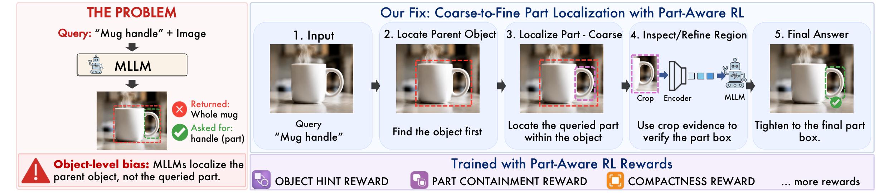

# Reasoning-Guided Part-Level Visual Grounding via Reinforcement Learning

[](https://arxiv.org/abs/2607.15374)
[](#-todo)
[](https://eccv.ecva.net/)

Official implementation of **"Reasoning-Guided Part-Level Visual Grounding via Reinforcement Learning"**, accepted to **ECCV 2026**.

<p align="center">
  
</p>

> ⏳ **We are currently cleaning up our code and preparing the checkpoints for release.** Stay tuned!

## 📢 News

- **June 2026** Paper accepted to ECCV 2026! 🎉
- **July 2026** Preprint available on [arXiv](https://arxiv.org/abs/2607.15374).
- **August 2026** Code and models release planned.

## 📝 Abstract

Multimodal large language models (MLLMs) ground whole objects well from free-form language queries, but they struggle when the query names a part rather than the object. We trace this to a missing object-part hierarchy, since parts are localized in the same single step used for objects. We propose Object-Part Hierarchical Reflective Grounding (OP-HRG), a coarse-to-fine reasoning-guided grounding strategy that first localizes the parent object and then the part within it. A self-check then reflects on the result, with an extension to re-encode the predicted crop to inspect the region it is correcting. We introduce a part-aware GRPO framework to train our pipeline with stage-wise rewards. A 4B model trained this way outperforms 7B grounding LLMs and SAM3 across PascalPart, PartImageNet, and InstructPart, and transfers to reasoning segmentation.

## 🚧 TODO

Repository is under active preparation. Planned releases:

- [x] ~~Release arXiv preprint / camera-ready PDF~~
- [ ] Release training, inference, and evaluation code
- [ ] Release Hugging Face model checkpoints
- [ ] Release dataset on Hugging Face or dataset preprocessing scripts (subject to license checking)
- [ ] Release Hugging Face demo
- [ ] Release baseline evaluation scripts

## 📄 Citation

If you find this work useful, please consider citing:

```bibtex
@misc{mehrab2026reasoningguidedpartlevelvisualgrounding,
      title={Reasoning-Guided Part-Level Visual Grounding via Reinforcement Learning}, 
      author={Kazi Sajeed Mehrab and Hani Alomari and Najibul Haque Sarker and Chia-Wei Tang and Zaber Ibn Abdul Hakim and Anuj Karpatne and Chris Thomas},
      year={2026},
      eprint={2607.15374},
      archivePrefix={arXiv},
      primaryClass={cs.CV},
      url={https://arxiv.org/abs/2607.15374}, 
}
```
