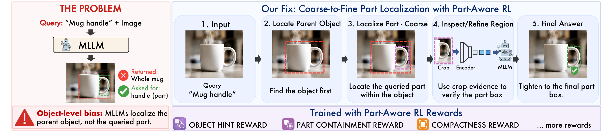

# Reasoning-Guided Part-Level Visual Grounding via Reinforcement Learning

[](https://link.springer.com/chapter/10.1007/978-3-032-37383-0_34)
[](https://arxiv.org/abs/2607.15374)
[](#-todo)
[](https://doi.org/10.1007/978-3-032-37383-0_34)
[](https://huggingface.co/ksmehrab/op-hrg-qwen3vl4b-instruct)

Official implementation of **"Reasoning-Guided Part-Level Visual Grounding via Reinforcement Learning"**, accepted to **ECCV 2026**.

<p align="center">
  
</p>

## Abstract

Multimodal large language models (MLLMs) ground whole objects well from free-form language queries, but they struggle when the query names a part rather than the object. We trace this to a missing object-part hierarchy, since parts are localized in the same single step used for objects. We propose Object-Part Hierarchical Reflective Grounding (OP-HRG), a coarse-to-fine reasoning-guided grounding strategy that first localizes the parent object and then the part within it. A self-check then reflects on the result, with an extension to re-encode the predicted crop to inspect the region it is correcting. We introduce a part-aware GRPO framework to train our pipeline with stage-wise rewards. A 4B model trained this way outperforms 7B grounding LLMs and SAM3 across PascalPart, PartImageNet, and InstructPart, and transfers to reasoning segmentation.

## Model weights: [Hugging Face](https://huggingface.co/ksmehrab/op-hrg-qwen3vl4b-instruct)

## Repository Structure

| Folder | Contents |
|---|---|
| `training/` | Modified EasyR1/veRL trainer, OP-HRG config, launch script, prompt, reward |
| `dataset_processing/` | Builds the training dataset from VisionReasoner-7k and InstructPart |
| `benchmarks/` | Loaders for InstructPart, PartImageNet and PascalPart, and the metric script |
| `evaluation/` | Evaluates an OP-HRG model on the three benchmarks |
| `baselines/` | SAM3 (text prompt) and VisionReasoner-7B on the three benchmarks |
| `environments/` | Conda environments |

Every bash script has its paths as variables at the top; edit them before running.

## 1. Environments

```bash
conda env create -f environments/ophrg.yml           # training, evaluation, dataset steps 1, 3, 4, 7, 8
conda env create -f environments/sam3.yml            # SAM3 baseline, dataset steps 2 and 5
conda env create -f environments/visionreasoner.yml  # VisionReasoner-7B baseline
conda env create -f environments/grdino.yml          # dataset step 6 (GroundingDINO)
```

Then install `flash-attn` into `ophrg` and `visionreasoner` (it needs torch at build time, so it is not in the env files):

```bash
conda run -n ophrg pip install flash-attn==2.8.3 --no-build-isolation
conda run -n visionreasoner pip install flash-attn==2.7.4.post1 --no-build-isolation
```

## 2. Data

### Benchmarks (evaluation)

Place the benchmarks under one folder, `BENCHMARK_ROOT`, with this layout:

```
BENCHMARK_ROOT/
  InstructPart/test/{images,masks}/
  PartImageNet/test/<synset>/*.JPEG
  PartImageNet/test.json
  PascalPart/Annotations_Part/*.mat
  Pascal_VOC_2012/VOCdevkit/VOC2012/JPEGImages/
```

- **InstructPart**: Google Drive folder from the official repository (https://github.com/zifuwan/InstructPart): https://drive.google.com/drive/folders/1b876tX1wdy-jbyLvGSmZkAS4U5DuXlST. Copy `test/` to `BENCHMARK_ROOT/InstructPart/test/`.
- **PartImageNet**: `PartImageNet_OOD.zip` from https://huggingface.co/datasets/turkeyju/PartImageNet. Unzip it, then unzip the `test.zip` inside it, so `test.json` and `test/` sit in `BENCHMARK_ROOT/PartImageNet/`.
- **PascalPart**: annotations from http://roozbehm.info/pascal-parts/trainval.tar.gz (extract `Annotations_Part/`). Images from PASCAL VOC 2012, http://host.robots.ox.ac.uk/pascal/VOC/voc2012/VOCtrainval_11-May-2012.tar. The evaluated image ids are in `benchmarks/pascalpart_val.txt`.

### Training dataset

The training dataset `VisionReasoner_InstructPart_Merged` has 8,899 rows: 7,099 from VisionReasoner-7k and 1,800 from InstructPart train. It is a HuggingFace `save_to_disk` folder. To build it:

1. Download InstructPart from the link above; `train/train1800/` is the training split.
2. Get GroundingDINO: `groundingdino_swinb_cogcoor.pth` from https://github.com/IDEA-Research/GroundingDINO/releases/download/v0.1.0-alpha2/groundingdino_swinb_cogcoor.pth and the config `groundingdino/config/GroundingDINO_SwinB_cfg.py` from the GroundingDINO repository.
3. Set the paths at the top of `dataset_processing/run_pipeline.sh` and run it. It uses 4 GPUs.

| Step | What it does |
|---|---|
| 1 | Downloads VisionReasoner-7k (`Ricky06662/VisionReasoner_multi_object_7k_840`) |
| 2 | SAM3 boxes for each VisionReasoner-7k query |
| 3 | Builds VisionReasoner-7k rows: `baseline_iou`, coordinates on a 0–1000 grid, images 1024×1024 |
| 4 | InstructPart ground-truth boxes (one per connected mask component) and points (box centers) |
| 5 | SAM3 boxes for each InstructPart query |
| 6 | GroundingDINO boxes of the whole object (`object_hint_boxes`) |
| 7 | Builds InstructPart rows |
| 8 | Concatenates the two parts |

Columns:
- `problem`: the query text.
- `solution`: JSON list of `{"bbox_2d", "point_2d"}` on a 0–1000 grid.
- `image`: 1024×1024 image.
- `object_part`: `True` for part queries.
- `object_hint_boxes`: boxes of the object that contains the part.
- `baseline_iou`: IoU of SAM3's boxes against the ground truth; the reward uses it as the IoU the answer must beat.

The training script writes cache files into the dataset folder, so the folder must be writable.

## 3. Training

Set `MODEL_PATH` (Qwen3-VL-4B-Instruct), `DATASET_PATH` and `CHECKPOINT_DIR` in `training/train_ophrg.sh`, then run:

```bash
conda activate ophrg
bash training/train_ophrg.sh
```

Settings are in `training/config_ophrg.yaml`: GRPO, 4 GPUs, checkpoint every 50 steps. Training logs to wandb (`WANDB_API_KEY`); set `trainer.logger=["console","file"]` to turn that off.

Each checkpoint (model and optimizer state) takes about 55 GB, so the 26 checkpoints of a full run need about 1.5 TB of disk; lower `trainer.save_limit` in `training/config_ophrg.yaml` to keep fewer.

Convert a checkpoint to HuggingFace format before evaluation:

```bash
python training/model_merger.py --local_dir <CHECKPOINT_DIR>/global_step_<N>/actor
```

The HuggingFace model is written to `<CHECKPOINT_DIR>/global_step_<N>/actor/huggingface`.

To train the two-stage active-perception variant (`active_vision.enabled: true`), run `export AV_INJECTION_STYLE=crop_generic` before launching; this gives the injected crop turn described in the paper.

## 4. Evaluation

`evaluation/run_eval.sh` starts with `MODEL_PATH=<REPLACE_WITH_YOUR_MODEL_PATH>`. **Replace this placeholder** with the path to a HuggingFace-format model folder, and set `BENCHMARK_ROOT` and `RESULTS_ROOT`. Then run:

```bash
bash evaluation/run_eval.sh
```

It runs InstructPart, PartImageNet and PascalPart on 4 GPUs. For each benchmark it writes per-query results and a `summary.txt` with gIoU (mean per-query mask IoU) and cIoU (total intersection / total union) to `RESULTS_ROOT/<benchmark>/`. PascalPart reports objects and parts separately. Masks come from SAM2 (`facebook/sam2-hiera-large`).

## 5. Baselines

```bash
bash baselines/sam3_text/run_sam3_text.sh
bash baselines/visionreasoner_7b/run_visionreasoner_7b.sh
```

- **SAM3** (`facebook/sam3`) is prompted with the query phrase; all returned instances are merged into one mask.
- **VisionReasoner-7B** (https://huggingface.co/Ricky06662/VisionReasoner-7B) uses its original prompt; SAM2 turns its boxes and points into masks.

Both write `summary.txt` files in the same format as `evaluation/`.


## 📢 News

- **July 2026** Paper accepted to ECCV 2026! 🎉
- **July 2026** Preprint available on [arXiv](https://arxiv.org/abs/2607.15374).
- **October 2026** First code and models released.

## 🚧 TODO

Repository is under active preparation. Planned releases:

- [x] Release arxiv camera-ready preprint
- [x] Release training, inference, and evaluation code 
- [x] Release Hugging Face model checkpoints
- [ ] Release dataset on Hugging Face or dataset preprocessing scripts (subject to license checking)
- [ ] Release Hugging Face demo
- [ ] Release baseline evaluation scripts

## Acknowledgements 
This work was supported by the [Imageomics Institute](https://imageomics.org), which is funded by the US National Science Foundation's Harnessing the Data Revolution (HDR) program under [Award #2118240](https://www.nsf.gov/awardsearch/showAward?AWD_ID=2118240) (Imageomics: A New Frontier of Biological Information Powered by Knowledge-Guided Machine Learning). Any opinions, findings and conclusions or recommendations expressed in this material are those of the author(s) and do not necessarily reflect the views of the National Science Foundation.

## 📄 Citation
If you find this work useful, please consider citing:
```bibtex
@inproceedings{mehrab2026reasoning,
  title={Reasoning-Guided Part-Level Visual Grounding via Reinforcement Learning},
  author={Mehrab, Kazi Sajeed and Alomari, Hani and Sarker, Najibul Haque and Tang, Chia-Wei and Hakim, Zaber Ibn Abdul and Karpatne, Anuj and Thomas, Chris},
  booktitle={European Conference on Computer Vision},
  pages={590--608},
  year={2026},
  organization={Springer}
}
```